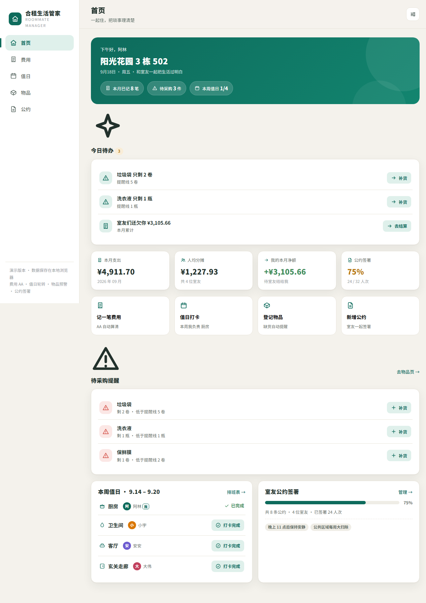
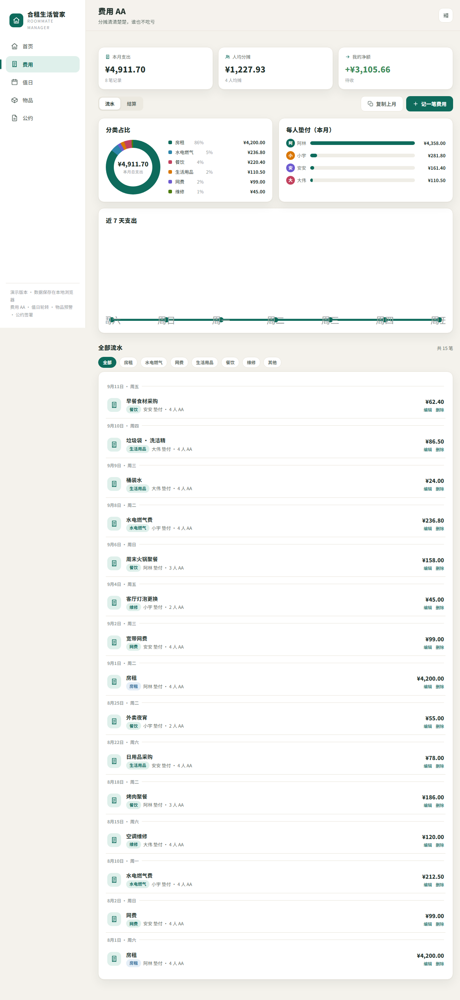
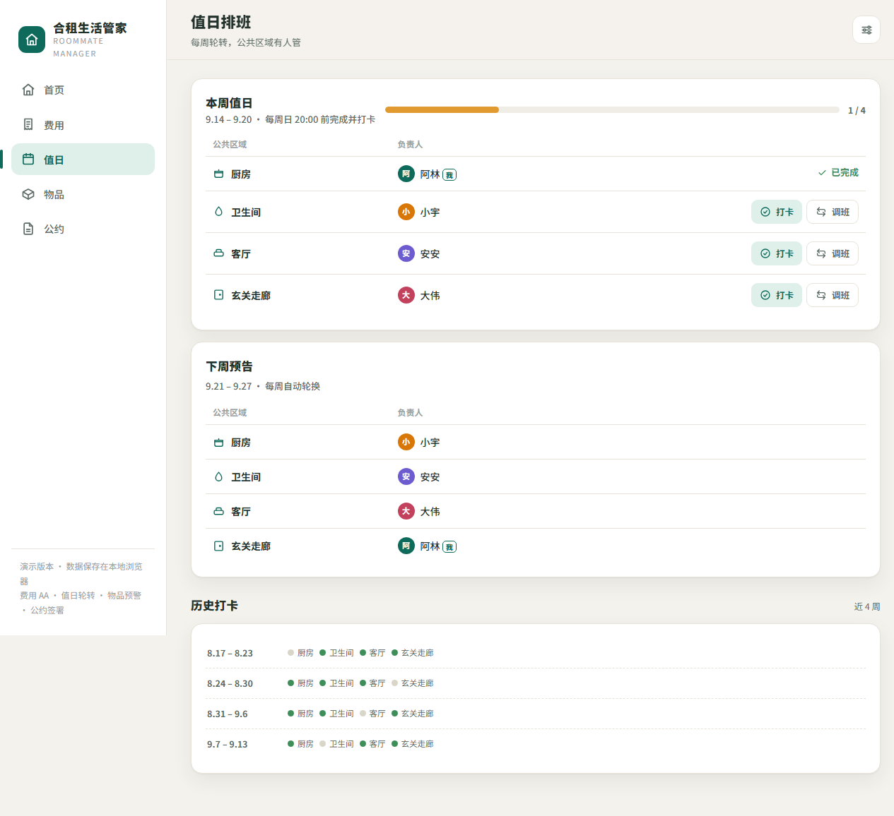
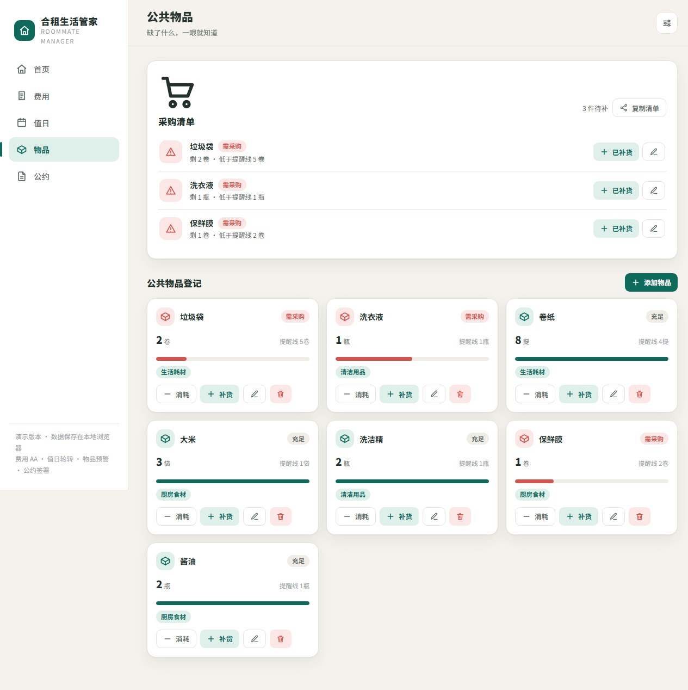
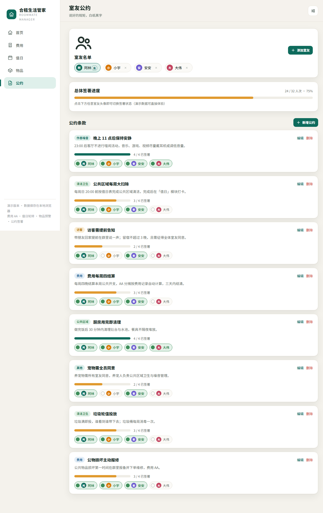

# 合租生活管家 · Roommate Manager

> 费用 AA 自动算清、值日排班轮流不吵架、公共物品缺了自动提醒、公共规矩一起定一起签。
> 一个面向年轻合租群体、开箱即用、数据保存在本地的单页 Web 应用。

**在线体验：https://dominique170519.github.io/roommate-manager/**（移动端可在浏览器菜单中「添加到主屏幕」，像 App 一样全屏使用）

---

## 产品背景

合租生活中最磨人的不是房租本身，而是**分摊不清、排班混乱、东西用完没人补、规矩说了不算**——这些鸡毛蒜皮最容易伤室友感情。

「合租生活管家」把四件高频摩擦事做成四个清晰模块，让每个问题的责任、进度、结果都**有记录、可追溯、不靠人情**。

## 功能模块

### 1. 首页 · 今日待办
- 聚合当天与你相关的所有事：本周值日未打卡、低库存补货、本月应收/应付、待签公约，一键直达对应操作
- 本周值日、公约签署进度、待采购提醒一眼可见

### 2. 费用 · AA 分摊
- 记录每笔公共开支：描述、金额、垫付人、分类、日期、参与 AA 的室友
- 自动算清每人分摊、月度支出、**收支净额**与**最少笔数转账建议**（结算页）
- 分类占比环形图、每人垫付对比、近 7 天支出趋势
- 流水支持**按分类筛选**、单条**编辑/删除**；每月房租水电用「**复制上月**」一键平移到本月
- 每周四结算日提醒，谁欠谁一目了然

### 3. 值日 · 排班打卡
- 公共区域按周自动轮换（厨房 / 卫生间 / 客厅 / 玄关走廊），每周日 20:00 前打卡
- **请假调班**：本周有事一键把区域换给指定室友，换班记录留痕、随时可撤销，首页待办同步更新
- 近 4 周历史打卡一目了然

### 4. 物品 · 公共物品登记
- 登记公共物品：名称、分类、当前数量、低库存提醒线、单位
- 库存低于提醒线自动进入「采购清单」，支持消耗 / 补货 / 编辑
- **复制清单**：一键生成采购清单文本发到室友群，谁方便谁带

### 5. 公约 · 室友公约管理
- 自定义公约条款（作息噪音 / 清洁卫生 / 访客 / 费用 / 公共区域…）
- 每位室友点击头像即可**签署 / 取消签署**，总体签署进度实时统计
- 公约可**编辑**、可**删除**，改完保留签署记录

### 设置与数据
- 首次使用 3 步引导：功能介绍 → 给小窝起名 → 填写室友
- **导出备份 / 导入备份**：数据一键导出为 JSON 文件，换设备、清浏览器后一键恢复
- 演示数据随时可重置体验

## 截图

| 首页 · 今日待办 | 费用 · AA 分摊与流水筛选 |
|---|---|
|  |  |

| 值日 · 排班与调班 | 物品 · 采购清单与登记 |
|---|---|
|  |  |

| 公约 · 签署与编辑 |
|---|
|  |

## 技术实现

- **单文件应用**：一个 `index.html` 内含全部 HTML / CSS / JavaScript，零依赖、零构建，拿到就能用
- **原生技术栈**：原生 JS + Hash 路由 + `localStorage` 持久化（无框架、无后端）
- **响应式**：桌面 / 手机 / 平板自适应；移动端可「添加到主屏幕」（PWA manifest + 图标 + 主题色）
- **视觉**：深 teal 主色 + 暖金点缀，内联 SVG 图标体系（不用 emoji），组件化重渲染

## 本地运行

```bash
# 任意静态服务器即可
python3 -m http.server 8080
# 或直接双击 index.html 用浏览器打开（localStorage 正常工作）
```

## 部署

本仓库通过 **GitHub Pages** 部署，源为 `main` 分支根目录。推送 `main` 后约 1 分钟自动更新：

```
https://dominique170519.github.io/roommate-manager/
```

> 演示版本数据保存在浏览器本地（localStorage），仅本机可见。多人协作版可在此基础上接入云端账号与实时同步。

## 许可证

MIT
